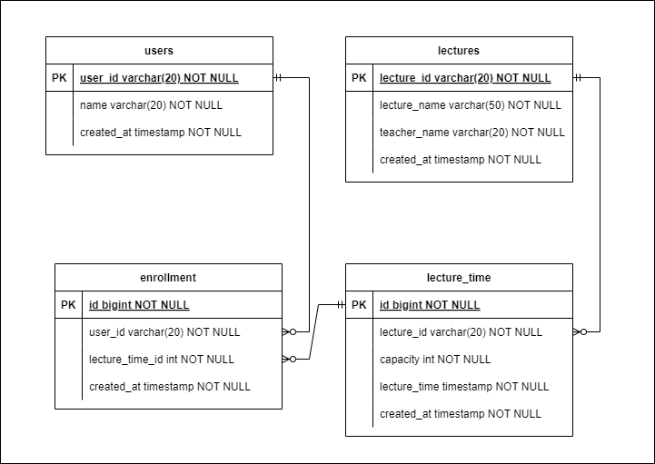

## 특강 신청 서비스

### 요구사항

- 특강 신청 API (핵심) `/lecture/register - POST`
  - 특정 userId 로 선착순으로 제공되는 특강을 신청하는 API 를 작성합니다.
  - 동일한 신청자는 동일한 강의에 대해서 한 번의 수강 신청만 성공할 수 있습니다.
  - 특강은 선착순 30명만 신청 가능합니다.
  - 이미 신청자가 30명이 초과되면 이후 신청자는 요청을 실패합니다.
- 특강 선택 API `/lecture/available - GET`
  - 날짜별로 현재 신청 가능한 특강 목록을 조회하는 API 를 작성합니다.
  - 특강의 정원은 30명으로 고정이며, 사용자는 각 특강에 신청하기전 목록을 조회해 볼 수 있어야 합니다. 
- 특강 신청 완료 목록 조회 API  `/lecture/enrollment-list/{userId} - GET`
  - 특정 userId 로 신청 완료된 특강 목록을 조회하는 API 를 작성합니다. 
  - 각 항목은 특강 ID 및 이름, 강연자 정보를 담고 있어야 합니다.

### ERD

### DB 설계

#### users (사용자 테이블)

1. 설계 이유 및 컬럼 설명: 사용자 정보가 존재하는 테이블입니다.
   1. `user_id`: 숫자로 사용하지 않고 String으로 사용 (조회 시 바로 알아볼 수 있게 하기 위함)
   2. `name`: 사용자명
   3. `created_at`: 등록 일시
#### lectures (특강 정보 테이블)

1. 설계 이유 및 컬럼 설명: 특강 기본 정보가 등록되어 있는 테이블입니다.
   1. `lecture_id`: 숫자로 사용하지 않고 String으로 사용 (조회 시 바로 알아볼 수 있게 하기 위함)
   2. `lecture_name`: 강의명 
   3. `teacher_name`: 강의자
   4. `created_at`: 등록 일시
#### lecture_time (특강 일정 테이블)

1. 설계 이유 및 컬럼 설명: 각 특강의 시간 및 정원 정보가 있는 테이블입니다. (1:N)
   1. `id`: 시퀀스를 사용하여 자동 증가합니다. (`lecture_id`, `lecture_time` 두 컬럼이 unique)
   2. `lecture_id`: 특강의 id (eg. `tdd`)
   3. `capacity`: 특강을 들을 수 있는 정원 (현재 최대 30명)
   4. `lecture_time`: 특강 시간 (한 강의가 여러 개의 특강 시간을 가질 수 있습니다.)
   5. `created_at`: 등록 일시
#### enrollment (특강 신청 테이블)

1. 설계 이유 및 컬럼 설명: 각 특강을 누가 등록했는지에 대한 정보 테이블입니다.
   1. `id`: 시퀀스를 사용하여 자동 증가 (`user_id`, `lecture_time_id`: 두 컬럼이 unique)
   2. `user_id`: 유저 id (eg.`user1`)
   3. `lecture_time_id`: 특강 일정의 id (eg.`1`)
   4. `created_at`: 등록일시 
